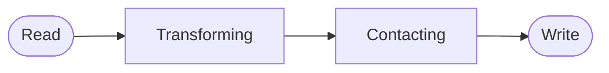
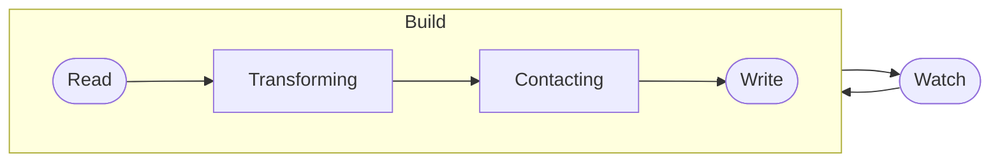

# New Ways to Vue

See how the new tools and techniques affect the way we <b>view</b> and build applications

Anthony Fu

  <logos:vue text="2xl"/>
  

    
Vue London

    
Oct. 20th, 2021

  

---
layout: 'intro'
---

# Anthony Fu

Vue & Vite core team member. 
Creator of Slidev, VueUse, Vitesse, Type Challenges, etc. 
Fanatical open sourceror. Working at <a href="https://nuxtlabs.com" target="_blank">NuxtLabs</a>. 

  <ri-github-line class="opacity-50"/>
  
<a href="https://github.com/antfu" target="_blank">antfu</a>

  <ri-twitter-line class="opacity-50"/>
  
<a href="https://twitter.com/antfu7" target="_blank">antfu7</a>

  <ri-user-3-line class="opacity-50"/>
  
<a href="https://antfu.me" target="_blank">antfu.me</a>

---
name: Sponsors
layout: center
---

 

  <a href="https://github.com/sponsors/antfu" target="_blank">
    Sponsor me at GitHub
  </a>

---
layout: center
---

# How Front-end Toolings Evolve

---

# Task Runners

<logos-gulp text="5xl" m="auto b-2"/>
Gulp

<logos-grunt text="5xl" m="auto b-2"/>
Grunt

###### Build

Task runners are commonly designed to be used with a single command 

###### Watch

When we want to have the build process reactive to the file changes, we apply a watcher to rerun the whole build process. This requires users to refresh the page to see the changes.

---

# Bundlers 

<logos-webpack text="5xl" m="auto b-2"/>
Webpack

<logos-rollup text="5xl" m="auto b-2"/>
Rollup

- Smarter to know the relationships between the modules
- Unchanged modules can be cached
- HMR

---

# Dev Servers 

<logos-snowpack text="5xl" m="auto b-2"/>
Snowpack

<logos-vite text="5xl" m="auto b-2"/>
Vite

- Unbundled
- On-demanded

---

# On-demanded?

What can we do with it?

> Not only about performance but also about opening a new gate to how we think and see the front-end development.

---

---
layout: center
class: 'text-center pb-5'
---

# Thank You!

Slides can be found on [antfu.me](https://antfu.me)
