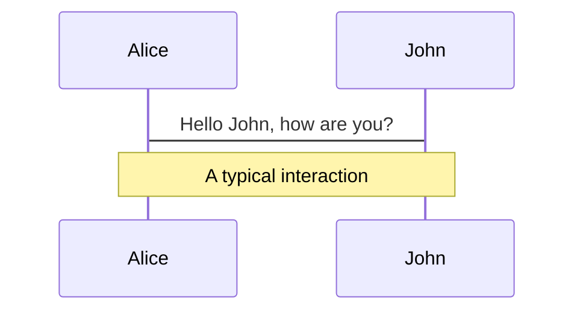
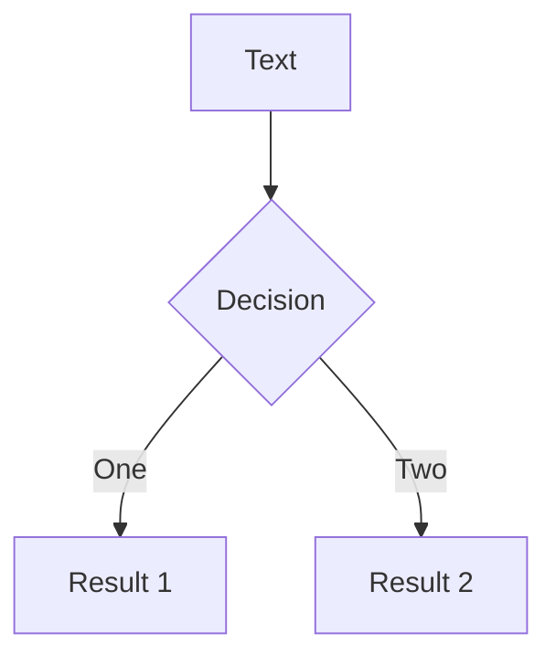

---
relates:
  - Mermaid: https://mermaid.js.org/
  - Mermaid Live Editor: https://mermaid.live/
  - Demo Slide: https://sli.dev/demo/starter/12
  - features/plantuml
tags: [diagram]
description: |
  Create diagrams/graphs from textual descriptions, powered by Mermaid.
---

# Mermaid Diagrams

You can also create diagrams/graphs from textual descriptions in your Markdown, powered by [Mermaid](https://mermaid.js.org/).

Code blocks marked as `mermaid` will be converted to diagrams, for example:

````md

````

You can further pass an options object to it to specify the scaling and theming. The syntax of the object is a JavaScript object literal, you will need to add quotes (`'`) for strings and use comma (`,`) between keys.

````md

````

Visit the [Mermaid Website](https://mermaid.js.org/) for more information.
