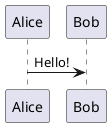

# PlantUML Diagrams

You can create PlantUML diagram easily in your slides, for example:

````md

````

The source code will be send to https://www.plantuml.com/plantuml to render the diagram by default. You can also setup your own server by setting the `plantUmlServer` in the [Slidev configuration](../custom/index#headmatter).

Visit the [PlantUML Website](https://plantuml.com/) for more information.
