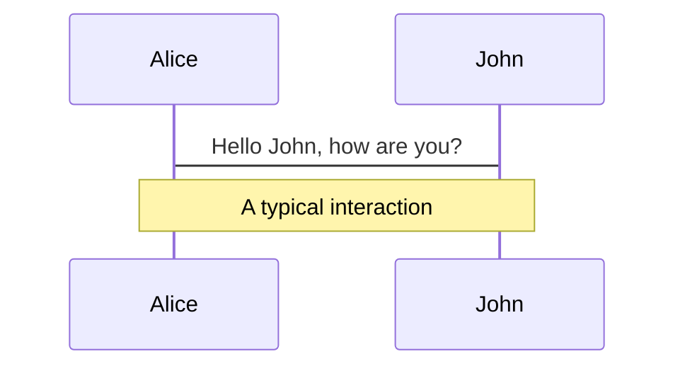
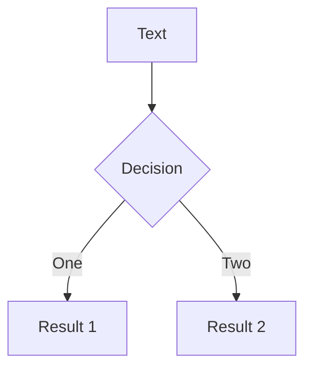

# Markdown Syntax

Slides are written within **a single markdown file** (by default `./slides.md`).

You can use [the Markdown features](https://github.com/adam-p/markdown-here/wiki/Markdown-Cheatsheet) as you normally would, with the additional support of inlined HTML and Vue Components. Styling using [UnoCSS](/custom/config-unocss) is also supported. Use `---` padded with a new line to separate your slides.

````md
# Slidev

Hello, World!

---

# Page 2

Directly use code blocks for highlighting

```ts
console.log('Hello, World!')
```

---

# Page 3

You can directly use Windi CSS and Vue components to style and enrich your slides.

<div class="p-3">
  <Tweet id="20" />
</div>
````

## Frontmatter & Layouts

Specify layouts and other metadata for each slide by converting the separators into [frontmatter blocks](https://jekyllrb.com/docs/front-matter/). Each frontmatter starts with a triple-dash and ends with another. Texts between them are data objects in [YAML](https://www.cloudbees.com/blog/yaml-tutorial-everything-you-need-get-started/) format. For example:

<!-- eslint-skip -->

```md
---
layout: cover
---

# Slidev

This is the cover page.

---
layout: center
background: './images/background-1.png'
class: 'text-white'
---

# Page 2

This is a page with the layout `center` and a background image.

---

# Page 3

This is a default page without any additional metadata.
```

Refer to [customization](/custom/) for more details.

### Prettier Support

> Available since v0.44

The custom syntax might not be compatible with some formatters like Prettier.
You can either install the [Prettier Plugin](/guide/editors#prettier-plugin) or use a direct `yaml` code block to define the frontmatter instead:

````md
---
layout: cover
---

# Slidev

This is the cover page.

---

```yaml
# The first yaml block will be treated as the frontmatter of that slide
layout: center
background: './images/background-1.png'
class: 'text-white'
```

# Page 2

This is a page with the layout `center` and a background image.
````

## Code Blocks

One big reason I am building Slidev is the need to make my code look just right in the slides. So just as you expected, you can use Markdown-flavored code block to highlight your code.

````md
```ts
console.log('Hello, World!')
```
````

We support [Prism](https://prismjs.com), [Shiki](https://github.com/shikijs/shiki) as syntax highlighters. Refer to [the highlighters section](/custom/highlighters) for more details.

### Line Highlighting

To highlight specific lines, simply add line numbers within bracket `{}`. Line numbers start counting from 1 by default.

````md
```ts {2,3}
function add(
  a: Ref<number> | number,
  b: Ref<number> | number
) {
  return computed(() => unref(a) + unref(b))
}
```
````

You can enable line number to all slides by setting `lineNumbers: true` on the config or enable each code block individually by setting `lines: true`. You can also set the starting line for each code block and highlight the lines accordingly, defaults to 1:

````md
```ts {6,7}{lines:true,startLine:5}
function add(
  a: Ref<number> | number,
  b: Ref<number> | number
) {
  return computed(() => unref(a) + unref(b))
}
```
````

To change the highlight in multiple clicks, you can use `|` to separate them:

````md
```ts {2-3|5|all}
function add(
  a: Ref<number> | number,
  b: Ref<number> | number
) {
  return computed(() => unref(a) + unref(b))
}
```
````

This will first highlight `a: Ref<number> | number` and `b: Ref<number> | number`, and then `return computed(() => unref(a) + unref(b))` after one click, and lastly, the whole block.

You can set the line number to `hide` to hide the code block or `none` to not highlight any line:

````md
```ts {hide|none}
function add(
  a: Ref<number> | number,
  b: Ref<number> | number
) {
  return computed(() => unref(a) + unref(b))
}
```
````

::: tip
Learn more in the [clicks animations guide](./animations#positioning).
:::

If the code doesn't fit into one slide, you use the `maxHeight` to set a fixed height and enable scrolling:

````md
```ts {2|3|7|12}{maxHeight:'100px'}
function add(
  a: Ref<number> | number,
  b: Ref<number> | number
) {
  return computed(() => unref(a) + unref(b))
}
/// ...as many lines as you want
const c = add(1, 2)
```
````

### TwoSlash Integration

> Available since v0.46

This feature is only available when you [set `highlighter` to `shiki`](/custom/highlighters)

[TwoSlash](https://twoslash.netlify.app/) is a powerful tool for rendering TypeScript code blocks with type information on hover or inlined. It's quite useful for preparing slides for JavaScript/TypeScript-related topics.

To use it, you can add `twoslash` to the code block's language identifier:

````md
```ts twoslash
import { ref } from 'vue'

const count = ref(0)
//            ^?
```
````

It will be rendered as:

```ts twoslash
import { ref } from 'vue'

const count = ref(0)
//            ^?
```

<!-- For the popup to not overlap the content below -->
<div class="py-20" />

### Shiki Magic Move

> Available since v0.48

[Shiki Magic Move](https://github.com/shikijs/shiki-magic-move) enables you to have a granular transition between code changes, similar to Keynote's Magic Move. You can check [the playground](https://shiki-magic-move.netlify.app/) to see how it works.

<video src="https://github.com/slidevjs/slidev/assets/11247099/79927794-27ba-4342-9911-9996cec889d6" controls rounded shadow w-full></video>

In Slidev, we bind it to the [clicks system](/guide/animations#click-animations). The syntax is to wrap multiple code blocks representing each step with <code>````md magic-move</code> (mind it's **4** backticks), this will be transformed into one code block, that morphs to each step as you click.

`````md
````md magic-move
```js
console.log(`Step ${1}`)
```
```js
console.log(`Step ${1 + 1}`)
```
```ts
console.log(`Step ${3}` as string)
```
````
`````

It's also possible to mix Magic Move with [line highlighting](#line-highlighting), for example:

`````md
````md magic-move {at:4} // [!code hl]
```js {*|1|2-5} // [!code hl]
let count = 1
function add() {
  count++
}
```

Non-code blocks in between as ignored, you can put some comments.

```js
let count = 1
const add = () => count += 1
```
````
`````

### Monaco Editor

<video src="https://github.com/slidevjs/slidev/assets/11247099/0c6ce681-80d3-4555-93bf-9288ee533462" controls rounded shadow w-full></video>

Whenever you want to do some modification in the presentation, simply add `{monaco}` after the language id — it turns the block into a fully-featured Monaco editor!

````md
```ts {monaco}
console.log('HelloWorld')
```
````

Learn more about [configuring Monaco](/custom/config-monaco).

#### Monaco Diff Editor

Monaco can also generate a diff between two code blocks. Use `{monaco-diff}` to turn the block into a [Monaco diff editor](https://microsoft.github.io/monaco-editor/playground.html?source=v0.36.1#example-creating-the-diffeditor-multi-line-example) and use `~~~` to separate the original and modified code!

````md
```ts {monaco-diff}
console.log('Original text')
~~~
console.log('Modified text')
```
````

#### Monaco Runner

> Available since v0.48

Slidev also provides the Monaco Runner Editor, which allows you to run the code directly in the editor and see the result. Use `{monaco-run}` to turn the block into a Monaco Runner Editor.

````md
```ts {monaco-run}
function distance(x: number, y: number) {
  return Math.sqrt(x ** 2 + y ** 2)
}
console.log(distance(3, 4))
```
````

It will provide the editor with a "Run" button, and shows the result right below the code block. You many also modify the code and the result will be re-evaluated on the fly.

By default it will automatically runs the code when the slide is loaded, if you want to always explicitly trigger the run, you can set `{autorun:false}`.

````md
```ts {monaco-run} {autorun:false}
console.log('HelloWorld')
```
````

Currently Slidev supports running JavaScript and TypeScript code out-of-box. Refer to [Custom Code Runners](/custom/config-code-runners) for custom languages support.

## Embedded Styles

You can use `<style>` tag in your Markdown directly to override styles for the **current slide**.

```md
# This is Red

<style>
h1 {
  color: red;
}
</style>

---

# Next slide is not affected
```

`<style>` tag in Markdown is always [scoped](https://vuejs.org/api/sfc-css-features.html#scoped-css). As an outstanding result, a selector with the child combinator (`.a > .b`) is unusable as such; see the previous link. To have global style overrides, check out the [customization section](/custom/directory-structure#style).

Powered by [UnoCSS](/custom/config-unocss), you can directly use nested css and [directives](https://unocss.dev/transformers/directives) (e.g. `--uno:` or `@apply`)

```md
# Slidev

> Hello `world`

<style>
blockquote {
  code {
    --uno: text-teal-500 dark:text-teal-400;
  }
}
</style>
```

## Static Assets

Just like you would do in markdown, you can use images pointing to a remote or local URL.

For remote assets, the built-in [`vite-plugin-remote-assets`](https://github.com/antfu/vite-plugin-remote-assets) will cache them into the disk at the first run so you can have instant loading even for large images later on.

```md

```

For local assets, put them into the [`public` folder](/custom/directory-structure.html#public) and reference them with a **leading slash**.

```md

```

If you want to apply custom sizes or styles, you can convert them to the `` tag

```html

```

## Notes

You can also take notes for each slide. They will show up in [Presenter Mode](/guide/presenter-mode) for you to reference during presentations.

In Markdown, the last comment block in each slide will be treated as a note.

```md
---
layout: cover
---

# Page 1

This is the cover page.

<!-- This is a note -->

---

# Page 2

<!-- This is NOT a note because it precedes the content of the slide -->

The second page

<!--
This is another note
-->
```

Basic Markdown and HTML are also supported in notes on Presenter rendering.

### Click Markers

> Available since v0.48

For some slides you might have longer notes that might be hard to find where you are looking at, we introduced the click markers that allow highlighting and auto-scrolling to the section of notes of your corresponding content. Put `[click]` markers in your notes for the timing you need to go to another [click](/guide/animations#click-animations), Slidev divides the content between the click markers and highlights them in presenter notes, synchronized with your slide progress.

<video src="https://github.com/slidevjs/slidev/assets/11247099/40014e34-67cd-4830-8c8d-8431754a3672" controls rounded shadow w-full></video>

## Icons

Slidev allows you to have access to almost all the popular open-source icon sets **directly** in your markdown after installing the corresponding package. Powered by [`unplugin-icons`](https://github.com/antfu/unplugin-icons) and [Iconify](https://iconify.design/).

The naming follows [Iconify](https://iconify.design/)'s conversion `{collection-name}-{icon-name}`. For example:

- `<mdi-account-circle />` - <mdi-account-circle /> from [Material Design Icons](https://github.com/Templarian/MaterialDesign) - [`@iconify-json/mdi`](https://npmjs.com/package/@iconify-json/mdi)
- `<carbon-badge />` - <carbon-badge /> from [Carbon](https://github.com/carbon-design-system/carbon/tree/main/packages/icons) - [`@iconify-json/carbon`](https://npmjs.com/package/@iconify-json/carbon)
- `<uim-rocket />` - <uim-rocket /> from [Unicons Monochrome](https://github.com/Iconscout/unicons) - [`@iconify-json/uim`](https://npmjs.com/package/@iconify-json/uim)
- `<twemoji-cat-with-tears-of-joy />` - <twemoji-cat-with-tears-of-joy /> from [Twemoji](https://github.com/twitter/twemoji) - [`@iconify-json/twemoji`](https://npmjs.com/package/@iconify-json/twemoji)
- `<logos-vue />` - <logos-vue /> from [SVG Logos](https://github.com/gilbarbara/logos) - [`@iconify-json/logos`](https://npmjs.com/package/@iconify-json/logos)
- And much more...

Browse and search for all the icons available with [Icônes](https://icones.js.org/).

### Styling Icons

You can style the icons just like other HTML elements. For example:

```html
<uim-rocket />
<uim-rocket class="text-3xl text-red-400 mx-2" />
<uim-rocket class="text-3xl text-orange-400 animate-ping" />
```

<uim-rocket />
<uim-rocket class="text-3xl text-red-400 mx-2" />
<uim-rocket class="text-3xl text-orange-400 animate-ping ml-2" />

## Slots

> Available since v0.18

Some layouts can provide multiple contributing points using [Vue's named slots](https://v3.vuejs.org/guide/component-slots.html).

For example, in [`two-cols` layout](https://github.com/slidevjs/slidev/blob/main/packages/client/layouts/two-cols.vue), you can have two columns left (`default` slot) and right (`right` slot) side by side.

```md
---
layout: two-cols
---

<template v-slot:default>

# Left

This shows on the left

</template>
<template v-slot:right>

# Right

This shows on the right

</template>
```

<div class="grid grid-cols-2 rounded border border-gray-400 border-opacity-50 px-10 pb-4">
<div>
<h3>Left</h3>
<p>This shows on the left</p>
</div>
<div>
<h3>Right</h3>
<p>This shows on the right</p>
</div>
</div>

We also provide a shorthand syntax sugar `::name::` for slot name. The following example works exactly the same as the previous one.

```md
---
layout: two-cols
---

# Left

This shows on the left

::right::

# Right

This shows on the right
```

You can also explicitly specify the default slot and provide in the custom order

```md
---
layout: two-cols
---

::right::

# Right

This shows on the right

::default::

# Left

This shows on the left
```

## Import Code Snippets

> Available since v0.47.0

You can import code snippets from existing files via the following syntax:

```md
<<< @/snippets/snippet.js
```

::: tip
The value of `@` corresponds to your package's root directory. It's recommended to put snippets in `@/snippets`, for compatibility with the Monaco editor. Alternatively, you can also import from relative paths.
:::

You can also use a [VS Code region](https://code.visualstudio.com/docs/editor/codebasics#_folding) to only include the corresponding part of the code file:

```md
<<< @/snippets/snippet.js#region-name
```

To explicitly specify the language of the imported code, you can add a language identifier after:

```md
<<< @/snippets/snippet.js ts
```

Any code block features like [line highlighting](#line-highlighting) and [Monaco editor](#monaco-editor) are also supported:

```md
<<< @/snippets/snippet.js {2,3|5}{lines:true}
<<< @/snippets/snippet.js ts {monaco}{height:200px}
```

## Configurations

All configurations needed can be defined in the Markdown file. For example:

```md
---
theme: seriph
layout: cover
background: 'https://source.unsplash.com/1600x900/?nature,water'
---

# Slidev

This is the cover page.
```

Learn more about [frontmatter configurations](/custom/#frontmatter-configures).

## LaTeX

Slidev comes with LaTeX support out-of-box, powered by [KaTeX](https://katex.org/).

<TheTweet id="1392246507793915904" />

### Inline

Surround your LaTeX with a single `$` on each side for inline rendering.

```md
$\sqrt{3x-1}+(1+x)^2$
```

### Block

Use two (`$$`) for block rendering. This mode uses bigger symbols and centers
the result.

```latex
$$
\begin{array}{c}

\nabla \times \vec{\mathbf{B}} -\, \frac1c\, \frac{\partial\vec{\mathbf{E}}}{\partial t} &
= \frac{4\pi}{c}\vec{\mathbf{j}}    \nabla \cdot \vec{\mathbf{E}} & = 4 \pi \rho \\

\nabla \times \vec{\mathbf{E}}\, +\, \frac1c\, \frac{\partial\vec{\mathbf{B}}}{\partial t} & = \vec{\mathbf{0}} \\

\nabla \cdot \vec{\mathbf{B}} & = 0

\end{array}
$$
```

Learn more: [Demo](https://sli.dev/demo/starter/8) | [KaTeX](https://katex.org/) | [`markdown-it-katex`](https://github.com/waylonflinn/markdown-it-katex)

### LaTex line highlighting

> Available since v0.43.1

To highlight specific lines, simply add line numbers within bracket `{}`. Line numbers start counting from 1 by default.

```latex
$$ {1|3|all}
\begin{array}{c}
\nabla \times \vec{\mathbf{B}} -\, \frac1c\, \frac{\partial\vec{\mathbf{E}}}{\partial t} &
= \frac{4\pi}{c}\vec{\mathbf{j}}    \nabla \cdot \vec{\mathbf{E}} & = 4 \pi \rho \\
\nabla \times \vec{\mathbf{E}}\, +\, \frac1c\, \frac{\partial\vec{\mathbf{B}}}{\partial t} & = \vec{\mathbf{0}} \\
\nabla \cdot \vec{\mathbf{B}} & = 0
\end{array}
$$
```

The `at` and `finally` options of [code blocks](#line-highlighting) are also available for LaTeX blocks.

### Chemical equations

To enable the redering of chemical equations, the [mhchem](https://github.com/KaTeX/KaTeX/tree/main/contrib/mhchem)
KaTeX extension needs to be loaded.

Create `vite.config.ts` with the following content:

```ts
import 'katex/contrib/mhchem'

export default {}
```

Now chemical equations can be rendered properly.

```latex
$$
\displaystyle{\ce{B(OH)3 + H2O <--> B(OH)4^- + H+}}
$$
```

Learn more: [Syntax](https://mhchem.github.io/MathJax-mhchem)

## Diagrams

You can also create diagrams / graphs from textual descriptions in your Markdown, powered by [Mermaid](https://mermaid-js.github.io/mermaid).

Code blocks marked as `mermaid` will be converted to diagrams, for example:

````md

````

You can further pass an options object to it to specify the scaling and theming. The syntax of the object is a JavaScript object literal, you will need to add quotes (`'`) for strings and use comma (`,`) between keys.

````md

````

Learn more: [Demo](https://sli.dev/demo/starter/9) | [Mermaid](https://mermaid-js.github.io/mermaid)

## Multiple Entries

> Available since v0.15

You can split your `slides.md` into multiple files and organize them as you want.

`slides.md` :

<!-- eslint-skip -->

```md
# Page 1

This is a normal page

---
src: ./subpage2.md
---

<!-- this page will be loaded from './subpage2.md' -->
Inline content will be ignored
```

`subpage2.md` :

```md
# Page 2

This page is from another file
```

### Frontmatter Merging

You can provide frontmatters from both your main entry and external markdown pages. If there are the same keys in them, the ones from the **main entry have the higher priority**. For example

`slides.md` :

```md
---
src: ./cover.md
background: https://sli.dev/bar.png
class: text-center
---
```

`cover.md` :

```md
---
layout: cover
background: https://sli.dev/foo.png
---

# Cover

Cover Page
```

They will end up being equivalent to the following page:

```md
---
layout: cover
background: https://sli.dev/bar.png
class: text-center
---

# Cover

Cover Page
```

### Page Reusing

With the multi-entries support, reusing pages could be straightforward. For example:

```yaml
---
src: ./cover.md
---

---
src: ./intro.md
---

---
src: ./content.md
---

---
# reuse
src: ./content.md
---
```

## MDC Syntax

> Available since v0.43.0

Slidev supports optional [MDC (Markdown Components) Syntax](https://content.nuxtjs.org/guide/writing/mdc) powered by [`markdown-it-mdc`](https://github.com/antfu/markdown-it-mdc).

You can enable it by adding `mdc: true` to the frontmatter of your markdown file.

```mdc
---
mdc: true
---

This is a [red text]{style="color:red"} :inline-component{prop="value"}

{width=500px lazy}

::block-component{prop="value"}
The **default** slot
::
```

Learn more about [the syntax](https://content.nuxt.com/guide/writing/mdc).
