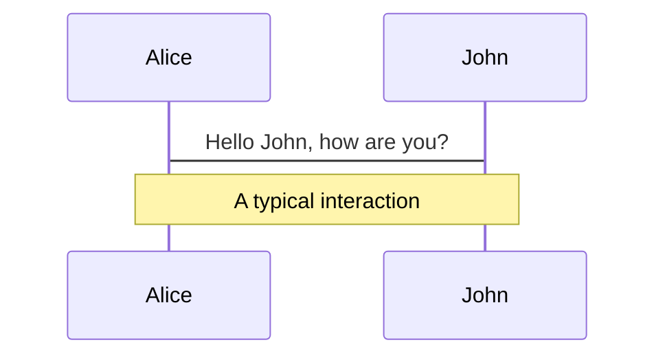
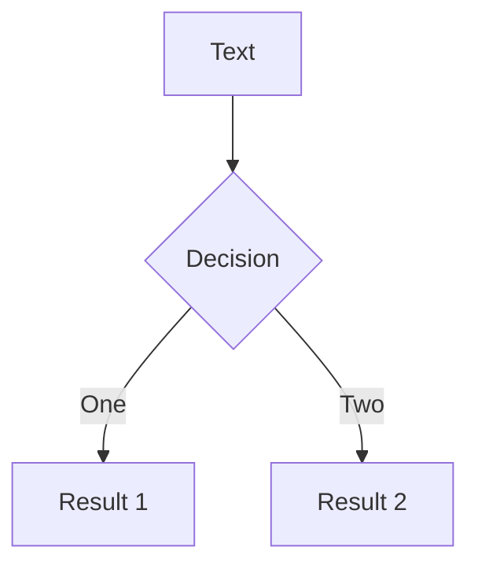

# Mermaid Diagrams

Create diagrams from text descriptions.

## Basic Usage

````md

````

## With Options

````md

````

## Diagram Types

- `graph` / `flowchart` - Flow diagrams
- `sequenceDiagram` - Sequence diagrams
- `classDiagram` - Class diagrams
- `stateDiagram` - State diagrams
- `erDiagram` - Entity relationship
- `gantt` - Gantt charts
- `pie` - Pie charts

## Resources

- Mermaid docs: https://mermaid.js.org/
- Live editor: https://mermaid.live/
