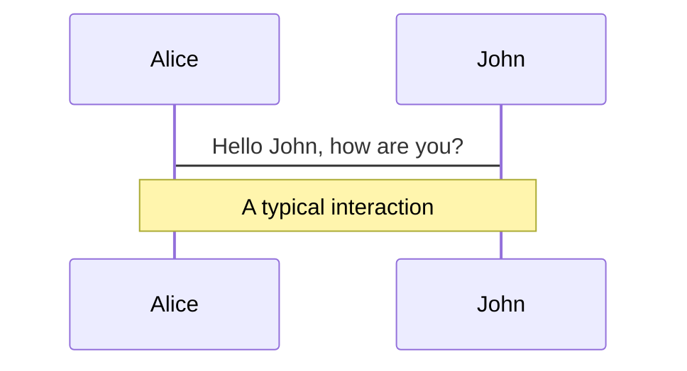
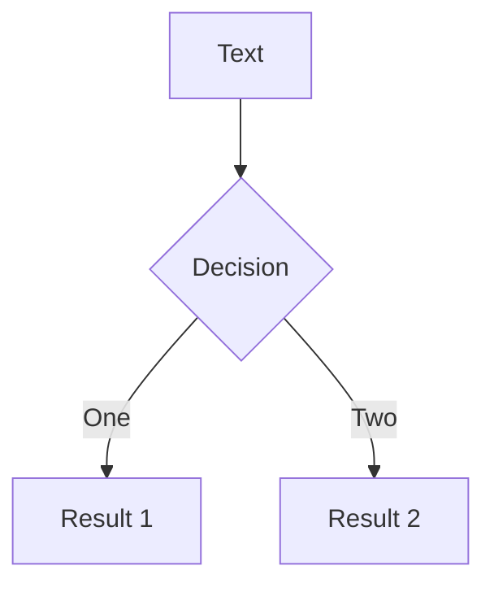

# Mermaid Diagrams

Create diagrams from text descriptions.

## Basic Usage

````md

```mermaid
sequenceDiagram
  Alice->John: Hello John, how are you?
  Note over Alice,John: A typical interaction
```
````

## With Options

````md

```mermaid {theme: 'neutral', scale: 0.8}
graph TD
B[Text] --> C{Decision}
C -->|One| D[Result 1]
C -->|Two| E[Result 2]
```
````

## Diagram Types

- `graph` / `flowchart` - Flow diagrams
- `sequenceDiagram` - Sequence diagrams
- `classDiagram` - Class diagrams
- `stateDiagram` - State diagrams
- `erDiagram` - Entity relationship
- `gantt` - Gantt charts
- `pie` - Pie charts

## Fit Guidance

For large Mermaid diagrams:

- Shorten labels before reducing scale.
- Split unrelated clusters into separate slides.
- Change graph direction when width or height is the limiting dimension.
- Use Mermaid `scale` or a local `<Transform>` for the diagram, not whole-slide `zoom`, when surrounding text already fits.
- Verify the rendered diagram in the browser or exported artifact.

See [layout-content-fit](layout-content-fit.md) for the broader dense-slide workflow.

## Resources

- Mermaid docs: https://mermaid.js.org/
- Live editor: https://mermaid.live/
