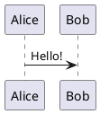

# PlantUML Diagrams

Create UML diagrams from text descriptions.

## Basic Usage

````md

````

## Server Configuration

Default: Uses https://www.plantuml.com/plantuml

Custom server in headmatter:

```md
---
plantUmlServer: https://your-server.com/plantuml
---
```

## Diagram Types

- Sequence diagrams
- Class diagrams
- Activity diagrams
- Component diagrams
- State diagrams
- Object diagrams
- Use case diagrams

## Resources

- PlantUML docs: https://plantuml.com/
- Live editor: https://plantuml.com/plantuml
